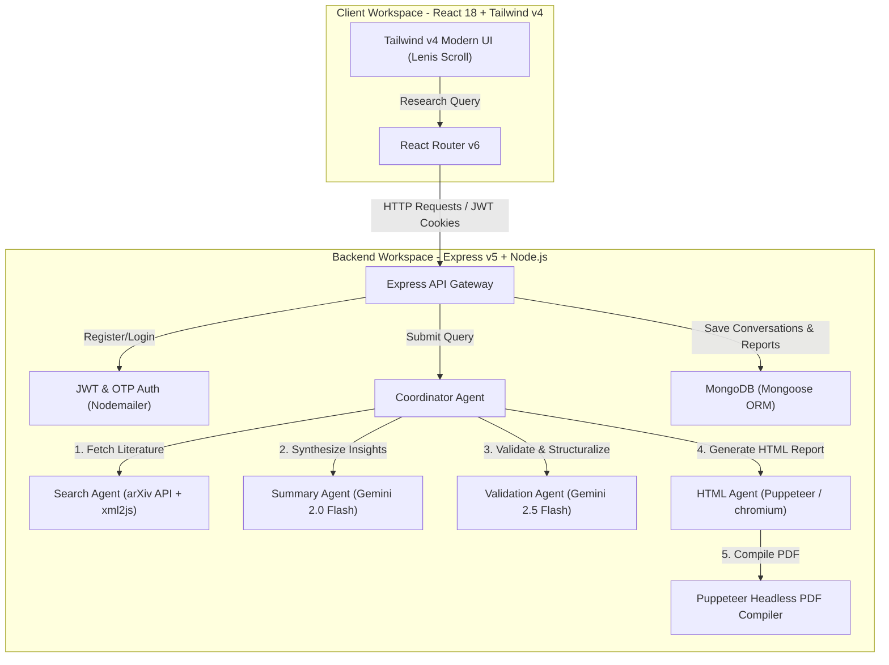

# 🧠 Deep-Draft — Your AI-Powered Multi-Agent Research Assistant

[](https://react.dev/)
[](https://vite.dev/)
[](https://tailwindcss.com/)
[](https://expressjs.com/)
[](https://www.mongodb.com/)
[](https://deepmind.google/technologies/gemini/)
[](https://github.com/kunal-rathore-111/MINOR_Backend)

Deep-Draft is a premium, high-performance **Multi-Agent Research Assistant** designed to discover, analyze, and synthesize academic papers into production-ready literature reviews. Built to streamline the academic workflow, Deep-Draft coordinates a group of specialized AI agents to query the arXiv API, clean text, perform vector-like analytical processing, validate academic accuracy, and generate beautifully formatted, downloadable PDF reports.

**Live Demo** → [minor-deploy-64gx.vercel.app](https://minor-deploy-64gx.vercel.app)

---

## 🚀 **Quick Recap for Technical Interviewers & HR**
*If you are evaluating my technical depth, here is the architectural and algorithmic complexity engineered into Deep-Draft:*

* **Multi-Agent Collaboration Pipeline**: Engineered a single-responsibility sequential agent architecture. The pipeline coordinates a **SearchAgent** (fetching paper metadata from arXiv APIs), a **SummaryAgent** (synthesizing key insights using Gemini 2.0 Flash), a **ValidationAgent** (performing rigorous factual and structural quality checks using Gemini 2.5 Flash), and an **HTMLAgent** (compiling structured text into clean semantic layouts).
* **Deterministic Structured JSON Outputs**: Leveraged Google Gemini's advanced structural inference modes backed by strict **Zod validation schemas**. This guarantees that all agent-to-agent message payloads are mathematically type-safe and validated before proceeding to the next node, completely mitigating generative hallucinations.
* **Pixel-Perfect Headless PDF Compilation**: Implemented a server-side report compiler powered by headless **Puppeteer** (utilizing `@sparticuz/chromium` for serverless environments). The system dynamically transforms raw HTML payloads into polished, downloadable PDF publications with customized headers, footers, pagination, and tables.
* **Secure Cryptographic OTP & Session Security**: Built a passwordless authentication protocol utilizing Nodemailer to deliver cryptographically secure OTPs (One-Time Passwords). Authenticated sessions are secured using cryptographically signed **JWT cookies** (HTTP-only) preventing XSS/CSRF token theft.
* **Fluid Premium Frontend Aesthetics**: Developed a highly immersive, responsive client using React 18, Vite 7, and Tailwind CSS v4. Implemented momentum-based inertial scrolling using **Lenis** and smooth micro-interactions via **Framer Motion** for a premium SaaS feeling.

---

## 📐 **System Architecture & Data Flow**

Deep-Draft coordinates services in a structured request-response cycle to ensure high accuracy, zero data leakage, and low latency.



---

## 🌟 **Key Features & Live Demo Insights**

### 1. 🪄 **Collaborative Multi-Agent Architecture**
* **Problem:** Standard LLM research queries return generic, unverified summaries that frequently hallucinate citations, misrepresent academic facts, or miss critical peer-reviewed literature.
* **Deep-Draft's Solution:** A coordinated pipeline of specialized agents:
  1. The **Search Agent** executes raw API queries directly against the arXiv database and parses the XML responses using `xml2js`.
  2. The **Summary Agent** compiles these results and synthesizes deep, comprehensive insights using Gemini 2.0 Flash.
  3. The **Validation Agent** cross-references the summary, performs a strict logical critique, checks for factual consistency, and validates the output structure against a Zod schema using Gemini 2.5 Flash.
  4. The **HTML Agent** templates the finalized critique into pixel-perfect semantic layouts.

### 2. 📄 **On-Demand Headless PDF Export**
* Summarized insights are automatically rendered into a complete, clean, downloadable PDF report.
* Backed by headless **Puppeteer** running serverless configurations, allowing users to print beautifully structured academic pamphlets with automated pagination, consistent page styling, and embedded citation arrays.

### 3. 🔒 **Advanced Passwordless OTP & JWT Authentication**
* Employs an ultra-secure authentication process using Nodemailer.
* Users register or sign in via dynamic One-Time Passwords (OTP) sent directly to their verified email addresses.
* Authenticated sessions are sustained through cryptographically signed **HTTP-only JWT cookies**, shielding client tokens from browser scripts and malicious extraction.

### 4. 🔗 **Legacy Integration & References**
* Deep-Draft is the modernized, fully refactored evolution of our original research-copilot project.
* The legacy, non-monolithic backend repository is fully accessible here: [MINOR_Backend Legacy Repository](https://github.com/kunal-rathore-111/MINOR_Backend).

---

## 🛠️ **Technological Breakdown (The Enterprise Stack)**

| Layer | Technologies | Key Design Choices & Rationale |
| :--- | :--- | :--- |
| **Frontend** | **React 18**, **Vite 7**, **React Router v6**, **Tailwind CSS v4**, **Framer Motion**, **Lenis** | • Vite 7 delivers near-instant dev server start-times and extremely optimized production builds.<br>• Tailwind CSS v4 provides cutting-edge utility-first styling with native CSS variable support.<br>• Lenis & Framer Motion cooperate to offer rich, high-fidelity web motion aesthetics. |
| **Backend** | **Node.js**, **Express v5**, **Mongoose (MongoDB)**, **Zod** | • Express v5 handles fast routing and native promise rejection handling.<br>• Mongoose provides rich, schema-enforced access controls for MongoDB storage.<br>• Zod guarantees complete request body sanitization at the gateway level. |
| **AI Agents** | **Google Gemini 2.0 & 2.5 Flash**, **arXiv API**, **xml2js** | • Google Gemini models ensure high-context speed and accurate semantic logic.<br>• The arXiv API supplies authentic, up-to-date scientific papers.<br>• Sequential multi-agent validation loops ensure bulletproof response reliability. |
| **PDF Generation** | **Puppeteer Core**, **@sparticuz/chromium** | • Renders beautiful print-media layouts in a serverless environment.<br>• Ensures pixel-perfect PDF reports complete with custom styling. |

---

## 🔒 **Production Security & Standards**

* **Secure HTTP-Only JWT Cookies**: Restricts XSS access to tokens by sealing session details in cryptographically signed, HTTP-only cookies.
* **OTP Verification TTL**: Verification OTPs use MongoDB TTL indices to automatically expire records within minutes, minimizing brute force attack opportunities.
* **Database Relational Integrity**: Cascading database schemas via Mongoose ensure conversational histories, references, and papers are never orphaned when profiles are updated.
* **Zero-Hallucination Guardrails**: The Validation Agent acts as a quality assurance gatekeeper, rejecting Gemini outputs that fail factual grounding or strict schema requirements.

---

## 💻 **Getting Started & Local Development**

### Prerequisites
* **Node.js** (v18.0 or higher recommended)
* A running **MongoDB** database instance
* Google Gemini API Key

### Installation

1. **Clone the repository:**
   ```bash
   git clone https://github.com/kunal-rathore-111/Deep-Draft.git
   cd Deep-Draft
   ```

2. **Configure Environment Variables:**
   Create a `.env` file inside the `server` directory by copying the example:
   ```bash
   cp server/env.example server/.env
   ```
   
   *Server `.env` configuration requirements:*
   ```env
   PORT=3000
   MONGOO_DB_URL=mongodb://localhost:27017/research-copilot
   JWT_SECRET=your_jwt_secret_min_32_chars
   GEMINI_API=your_google_gemini_api_key
   EMAIL_ID=your_email@gmail.com
   EMAIL_PASS=your_gmail_app_password
   BACKEND_BASE_Url=http://localhost:3000/app/api
   ```

3. **Install Dependencies & Start the Servers:**

   **Terminal 1 (Backend Server):**
   ```bash
   cd server
   npm install
   npm run dev
   ```

   **Terminal 2 (Frontend Client):**
   ```bash
   cd client
   npm install
   npm run dev
   ```

---

## 🎨 **Design System & Aesthetics**
Deep-Draft's interface is custom-tailored to provide a premium SaaS feeling:
* **Typography:** Modern clean layout utilizing premium sans-serif typography for readability.
* **Dynamic Animations:** Micro-interactions on buttons, input elements, card selections, and agent state transitions built using custom Framer Motion variants.
* **Layout Integrity:** Responsive layouts and adaptive flex architectures ensuring a perfect desktop, tablet, and mobile interface.

---

*Engineered with 💻 & ☕ by Kunal Rathore. Connect with me on [GitHub](https://github.com/kunal-rathore-111) or [LinkedIn](https://www.linkedin.com/in/kunal-rathore-11-in).*
